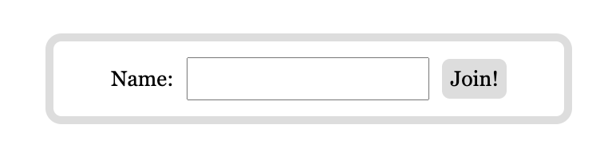

# インメモリ

Redis を使ってインメモリデータベースを体験します。  

## コンテナ起動

```bash
# mongodb ディレクトリへ移動
$ cd $WORKDIR/redis

# Chat ビルド
$ docker-compose build

# コンテナ起動
$ docker-compose up -d

# コンテナ起動確認
$ docker-compose ps
NAME            IMAGE          COMMAND                   SERVICE   CREATED          STATUS          PORTS
redis-chat-1    redis-chat     "ruby redis_pubsub_d…"   chat      17 seconds ago   Up 17 seconds   0.0.0.0:3001->3001/tcp, 0.0.0.0:8082->8082/tcp     # STATUS が Up であること、PORTS が 0.0.0.0:8082->8082 であることを確認
redis-redis-1   redis:latest   "docker-entrypoint.s…"   redis     17 seconds ago   Up 17 seconds   6379/tcp                                           # STATUS が Up であること、PORTS が 6379 であることを確認
```

# Redis 実習

```bash
# コンテナ内部へ
$ docker-compose exec redis bash
root@3afc704709bc:/data#   # プロンプトが変わっていることを確認

# redis-cli 起動
redis-cli 
127.0.0.1:6379>  # プロンプトが変わっていることを確認

# データ挿入、Key-Value 形式
127.0.0.1:6379> SET mykey1 "hello"
OK

# データ取得
127.0.0.1:6379> GET mykey1
"hello"

# データ挿入その2、複数キー
127.0.0.1:6379> MSET mykey2 "cool" mykey3 "hot"

# データ取得その2、複数キー
127.0.0.1:6379> MGET mykey2 mykey3

# キー一覧
127.0.0.1:6379> keys *
1) "mykey2"
2) "mykey3"
3) "mykey1"

# 数値をインクリメントする
127.0.0.1:6379> set mynum 1
OK
127.0.0.1:6379> get mynum
"1"
127.0.0.1:6379> incr mynum
(integer) 2
127.0.0.1:6379> get mynum
"2"

# キーの TTL(有効期間) を設定する
127.0.0.1:6379> set city shibuya
OK
# TTL は10秒
127.0.0.1:6379> expire city 10
(integer) 1
127.0.0.1:6379> get city
"shibuya"
# 残り時間を確認
127.0.0.1:6379> ttl city
(integer) 2
127.0.0.1:6379> get city
(nil)        # 有効期間が切れたので nil が返る

# 今まで入力したデータの削除
127.0.0.1:6379> flushall
```


## チャット

ブラウザで `http://127.0.0.1:3001/` を開きます。  
任意の名前を入れてチャットに入室します。  




もう1つブラウザタブを開いて `http://127.0.0.1:3001/` に別の名前で入室します。  
チャットができるはずなのでしばらくチャットしてみてください。  
※ 日本語を入力すると落ちますので、アルファベットと半角数字のみでお願いします。  

このチャットは Redis の Pub/Sub 機能を使っているので、Redis のコンテナ内で以下のコマンドを実行するとチャットの内容が確認できます。  

```bash
127.0.0.1:6379> PSUBSCRIBE *
127.0.0.1:6379(subscribed mode)>      # プロンプトが変わっていることを確認
# 1回だけエンターキーを押します
Reading messages... (press Ctrl-C to quit or any key to type command)   # この表示になったら OK
```

チャットを繰り返すと入力したメッセージが表示されると思います。  
片方のブラウザで打った文字が Publish され、もう一方のブラウザでは Subscribe されている文字が表示される仕組みです。  


## コンテナ停止

```bash
# redis-cli からログアウト
127.0.0.1:6379>  exit

# コンテナからログアウト
root@3afc704709bc:/data# exit

# コンテナ停止
$ docker-compose down
[+] Running 3/3
✔ Container redis-redis-1  Removed
✔ Container redis-chat-1  Removed
✔ Network redis_default    Removed

$ docker-compose ps
NAME      IMAGE     COMMAND   SERVICE   CREATED   STATUS    PORTS
# 結果がないことを確認
```


## 参考

[Documentation](https://redis.io/docs/)  
[web chat sample](https://gist.github.com/rtcoms/f1a039d785f5d868f5734055461fddc8)  
